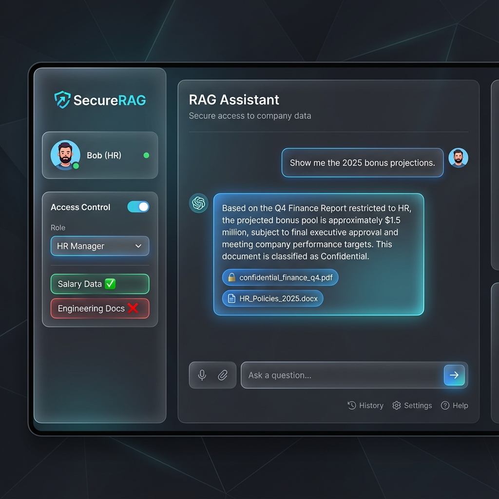

# IAM RAG PoC - Walkthrough

## Prerequisites
1. **Supabase Project**: You need a running Supabase project (cloud or local).
2. **OpenAI API Key**: Required for embeddings and chat.

## Setup Steps

### 1. Database Setup
Run the SQL found in [schema.sql](supabase/schema.sql) and [seed.sql](supabase/seed.sql) in your Supabase SQL Editor.

### 2. Configure Environment
Edit the [.env](.env) file with your credentials:
```bash
OPENAI_API_KEY=sk-...
SUPABASE_URL=...
SUPABASE_SERVICE_KEY=...
```
> **Note**: Use the `service_role` key for the seeding script (to bypass RLS during write), but the app technically simulates the "backend" so it also needs high-level access to *set* the session variables.

### 3. Check Dependencies
Ensure your venv is active:
```bash
source rag-acl/bin/activate
```

## Running the Demo

### Step 1: Ingest Data
Populate the vector store with the mock documents.
```bash
python src/ingest.py
```

### Step 2: Launch the App
Start the Streamlit interface.
```bash
streamlit run src/app.py
```

## Usage Scenarios

| User Role | Can See | Test Question | Expected Result |
|-----------|---------|---------------|-----------------|
| **Engineer** | Engineering, IT, Public | "deployment key?" | Returns key from vault |
| **HR** | HR, Public | "deployment key?" | "I don't don't have access" |
| **Intern** | IT(Restricted), Public | "wifi password?" | Returns wifi info |
| **Public** | Public | "bonuses?" | "I don't have access" |

## Manual Testing Script

Follow these steps to verify that the RAG system correctly enforces IAM rules.

### Test Case 1: The "Engineer" Persona (High Access)
**Goal**: Verify access to technical secrets and public info.
1. Select **Engineer** from the sidebar dropdown.
2. Observe the Permissions Panel: Should show ✅ Engineering Docs, ✅ Internal IT, ✅ Public Info.
3. Type: `"What is the deployment key?"`
   - **Expected**: "The production deployment key is hidden in the ci-cd-secrets vault."
   - **Source**: `engineering_guide.txt`
4. Type: `"How do I reset the wifi?"`
   - **Expected**: "To reset the wifi password, visit 192.168.1.1/admin."
   - **Source**: `it_guide.txt`
5. Type: `"What is the executive bonus?"`
   - **Expected**: "I don't have access to information about that." or a generic refusal.
   - **Reason**: Engineers do not have the 'hr' role.

### Test Case 2: The "HR" Persona (Sensitive Access)
**Goal**: Verify access to salary data but NOT technical secrets.
1. Switch sidebar to **HR**.
2. Type: `"What is the executive bonus?"`
   - **Expected**: "Executive bonuses are calculated as 5% of net profit."
   - **Source**: `executive_comp.txt`
3. Type: `"What is the deployment key?"`
   - **Expected**: "I don't have access..."
   - **Reason**: **RLS Enforcement**. The vector search returned 0 documents because the database filtered them out before the LLM even saw them.

### Test Case 3: The "Intern" Persona (Restricted)
**Goal**: Verify partial access.
1. Switch sidebar to **Intern**.
2. Type: `"How do I reset the wifi?"`
   - **Expected**: Returns the wifi info (Interns are allowed in `it_guide.txt`).
3. Type: `"What is the bonus?"`
   - **Expected**: Access Denied.

### Test Case 4: The "Public" Persona (No Access)
**Goal**: Verify zero-trust for unauthenticated users.
1. Switch sidebar to **Public**.
2. Type: `"What is the deployment key?"`
   - **Expected**: Access Denied.
3. Type: `"What is on the roadmap?"`
   - **Expected**: "Our public roadmap includes Q4 launch..."
   - **Source**: `public_web.txt`

## UI Mockup
Here is a high-fidelity concept of the interface:

